# PRÁCTICA No. 5 Teorema de Thévenin

#### Integrantes:

CALDERON VIDAL MATEO ESTEBAN

CAMACHO SIZA JOSUE EVERETT

GUEVARA CARVAJAL LUIS EDUARDO

#### NRC:

5406

### Objetivo

*Objetivo General*

- Comprender  el Teorema de Superposición, para determinar los voltajes y las corrientes presentes en un circuito eléctrico.

*Objetivos específicos*

- Comprobar la efectividad del uso del teorema de superposición para el análisis de circuitos.

- Realizar comparaciones entre los datos teóricos usando el teorema de superposición y los datos prácticos adquiridos en el desarrollo de la práctica.

- Entender las conexiones y forma de uso del protoboard, del multímetro y de los   demás materiales de laboratorio para hacer un uso correcto de ellos, ya que cada uno tiene una forma específica de uso.

### Marco teórico

Utilizando la teoría de circuitos, se pueden adquirir nociones para entender, diseñar y modificar circuitos eléctricos. Este se encuentra definido como la interconexión de distintos componentes, formando caminos a través de los cuales la corriente eléctrica realiza un recorrido. Para que se logre que estos funcionen correctamente, es necesaria la aplicación de leyes y teoremas que permiten su construcción, obteniendo los resultados adecuados. El teorema de Thévenin es uno de los enunciados básicos de la teoría de circuitos. A través de este, es posible calcular y simplificar un sistema eléctrico.

Aplicando este teorema, se puede convertir un circuito complejo, el cual cuenta con dos terminales, a uno simple, compuesto por una sola fuente de voltaje en serie con una resistencia.

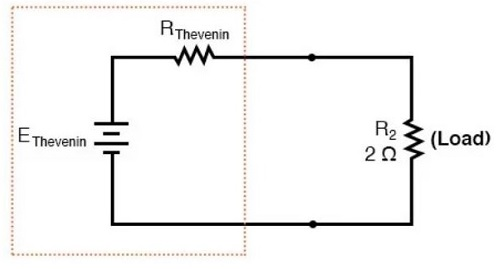

Pero también se puede aplicar a la par con el teorema de Norton. Este permite convertir un circuito grande en uno más simple para poder calcular los valores entre dos puntos de un circuito dado, teniendo presente la resistencia de carga. Es considerado como el dual de Thévenin, ya que ambos son aplicados con el mismo fin. Si conoces la teoría de uno, puedes aplicar fácilmente el otro y viceversa.

Se ha considerado como ventajoso la aplicación del teorema de Thévenin en circuitos complejos para obtener un circuito equivalente más simple. A través de este, se facilitan los cálculos de la tensión de carga y la corriente de carga. Además, se sabe que los valores de la resistencia de carga pueden variar; en el caso de los valores que se obtienen una vez aplicado Thévenin, estos permanecen constantes. Si se llega a cambiar la carga, entonces el procedimiento seguiría siendo simple.

A través de la aplicación del teorema de Thévenin, se logra que un circuito complejo se convierta en uno más simple. De esta manera, se expresa que al existir dos terminales A y B dentro de la estructura de un circuito eléctrico lineal, es posible convertirlo a un circuito equivalente más simple. La teoría expresa que a través de la resistencia del circuito transformado la corriente seguirá circulando.

### Explicación del procedimiento

*Material y equipo requerido*

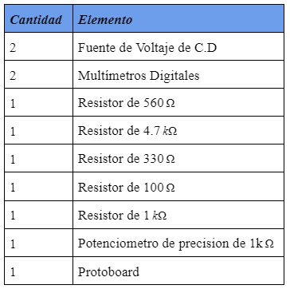

Tabla I. Materiales y Equipo

*Pasos a seguir*

1. Iniciar el Tinkercad y seleccionar los materiales a utilizar.

2. Preparar los materiales en el simulador: resistencia con cada valor y las fuentes de energía.

3. Elaborar un circuito con las resistencias con la forma indicada en la guía.

4. Medir cada uno de los voltajes, corrientes de la Resistencia 5 y anotar los resultados.

5. Analizar el circuito por el teorema de Thévenin para obtener los resultados analíticos de cada voltaje y de cada corriente.

6. Completar las tablas respectivas con cada uno de los resultados obtenidos.

*Procedimiento*

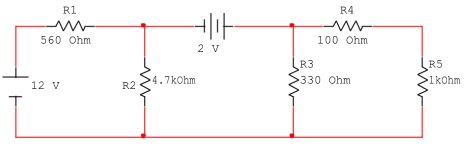

Figura 1.- Circuito para comprobar el Teorema de Thévenin

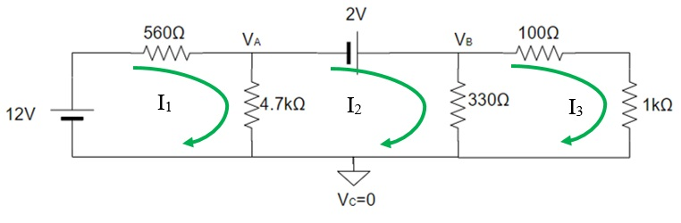

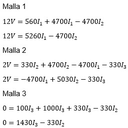

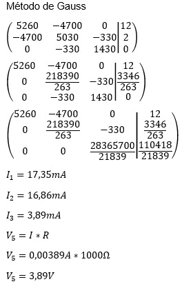

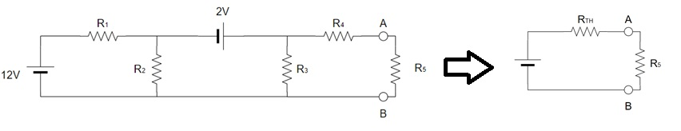

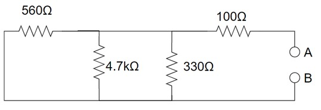

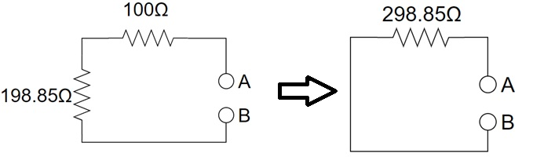        

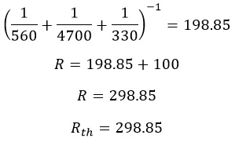

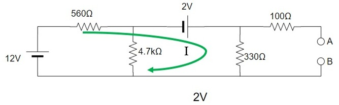

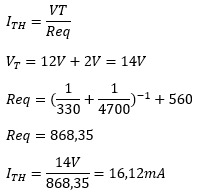

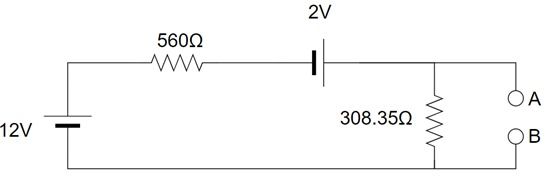

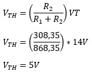

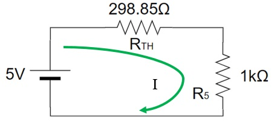

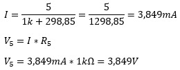

### Resultados

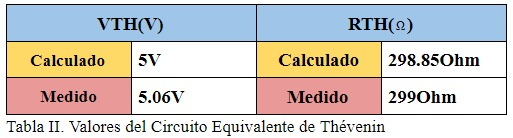

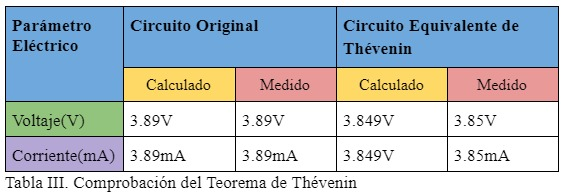

*Porcentaje de error relativo entre los valores teóricos y los experimentales*

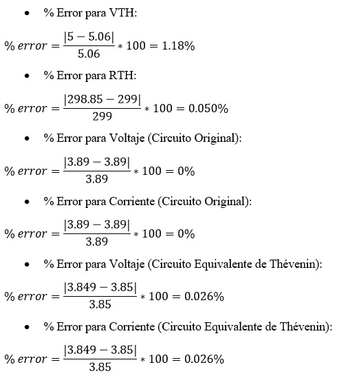

*Análisis de los resultados*

- El teorema de Thévenin permitio evaluar los datos, con la ayuda de las distintas leyes y metodos aprendidos para calcular la corriente y voltaje que circula.

- Se observo que tanto los resultados analizados como los calculados son iguales con un mínimo margen de error.

### Video

### Conclusiones

- El teorema de Thévenin es muy util por que  nos  permite  reducir  un  circuito complejo, a uno con una configuracion mas sencilla y con ello analizar los datos pedidos.

- Se puede concluir que se pudo aplicar y demostrar el teorema de Thévenin en el desarrollo de este circuito siguiendo sus proceso, facilitando su solucion.

- Gracias al desarrollo y simulacion de este circuito tenemos un mayor entendimiento de este teorema.

### Anexos

*Anexo 1.- Circuito en Tinkercad.*

*Anexo 2.- Circuito en Tinkercad.*

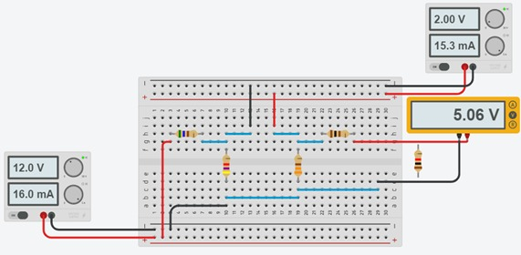

*Anexo 3.- Circuito en Tinkercad.*

*Anexo 4.- Circuito en Tinkercad.*

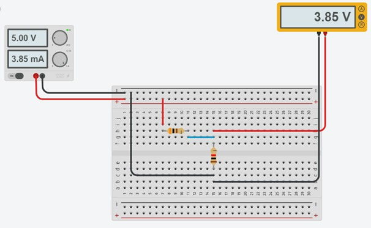

*Anexo 5.- Circuito en Tinkercad.*

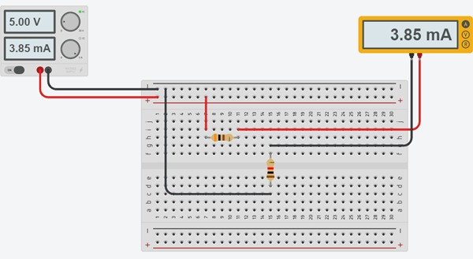

*Anexo 6.- Circuito en Tinkercad.*

### Bibliografía

Dorf,  S.  (2006).  Circuitos eléctricos. Mexico: Alfaomega.}  

Teorema  de  Thévenin (2021)  Obtenido de: https://es.wikipedia.org/wiki/Teorema_de_Th%C3%A9venin  

TUVERAS. (2011). TUVERAS.com. Obtenido de TUVERAS.com: http://www.tuveras.com/electrotecnia/teoremas/thevenin.htm
